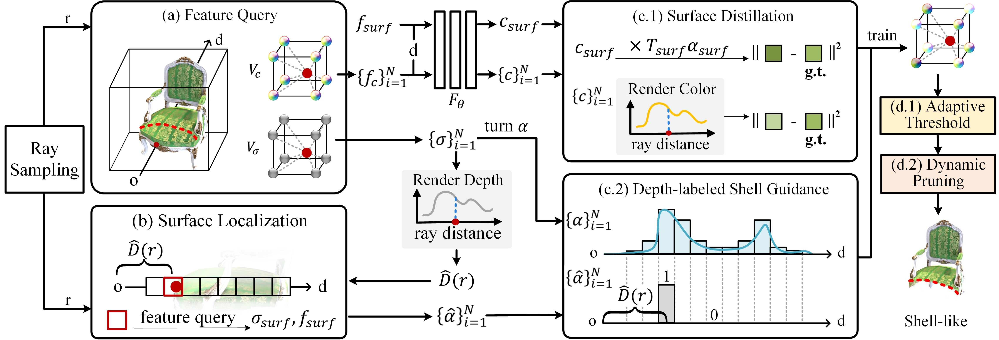

# SVRF: Shell-guided Compression of Voxel Radiance Fields
#### IEEE Transactions on Image Processing, 2025

Peiqi Yang<sup>1</sup>, [Zhangkai Ni](https://eezkni.github.io/)<sup>1</sup>, [Hanli Wang](https://scholar.google.com/citations?user=WioFu64AAAAJ&hl=zh-CN)<sup>1</sup>, [Wenhan Yang](https://flyywh.github.io/)<sup>2</sup>,  [Shiqi Wang](https://scholar.google.com/citations?user=Pr7s2VUAAAAJ&hl=en)<sup>3</sup>, [Sam Kwong](https://scholar.google.com/citations?user=_PVI6EAAAAAJ&hl=zh-CN)<sup>4</sup>

<sup>1</sup>Tongji University, <sup>2</sup>Peng Cheng Laboratory, <sup>3</sup>City University of Hong Kong, <sup>4</sup>Lingnan Univerity

This repository provides the official implementation for the paper "SVRF: Shell-guided Compression of Voxel Radiance Fields," IEEE Transactions on Image Processing, vol. 34, pp. 1179-1191, 2025. [Paper](https://ieeexplore.ieee.org/document/10879387)



## About SVRF

SVRF (Shell-guided compression of Voxel Radiance Fields) was designed to address the challenge of significant memory consumption and redundant components in large-scale voxel-based model, which are commonly encountered in real-world 3D reconstruction scenarios.
In this work, we aimed at optimizing voxel-based model into a shell-like structure to reduce storage costs while maintaining rendering accuracy.
Specifically, we first introduce a Shell-like Constraint, operating in two main aspects: 1) enhancing the influence of voxels neighboring the surface in determining the rendering outcomes, and 2) expediting the elimination of redundant voxels both inside and outside the surface.
Additionally, we introduce an Adaptive Thresholds to ensure appropriate pruning criteria for different scenes. 
To prevent the erroneous removal of essential object parts, we further employ a Dynamic Pruning Strategy to conduct smooth and precise model pruning during training. 
The compression method we propose does not necessitate the use of additional labels. It merely requires the guidance of self-supervised learning based on predicted depth. Furthermore, it can be seamlessly integrated into any voxel-grid-based method. 
Extensive experimental results demonstrate that our method achieves comparable rendering quality while compressing the original number of voxel grids by more than 70%.

**TL;DR:** We introduce a novel method aimed at optimizing voxel-based model into a shell-like structure to reduce storage costs while maintaining rendering accuracy.

## Experimental Results
1. Quantitative comparison for novel view synthesis on Synthetic-NeRF and Tanks and Temples shows our method outperforms most methods while ensuring faster training and low memory usage. The top three performances are marked in red, orange, and yellow backgrounds. “Size” is in MB.

<!-- <div align="center">  </div> -->
<div align="center">  </div>

2. Quantitative comparison for novel view synthesis on Synthetic-NSVF and BlendedMVS shows our SVRF outperforms most methods while ensuring faster training and low memory usage.

<div align="center">  </div>
<!-- <div align="center">  </div> -->


## Environment setup
To start, we prefer creating the environment using conda:
```sh
conda create -n svrf
conda activate svrf
pip install -r requirements.txt
cd lib/cuda
python setup.py install
```

[Pytorch](https://pytorch.org/) and [torch_scatter](https://github.com/rusty1s/pytorch_scatter) installation is machine dependent, please install the correct version for your machine.

<details>
  <summary> Dependencies (click to expand) </summary>

  - `PyTorch`, `numpy`, `torch_scatter`: main computation.
  - `scipy`, `lpips`: SSIM and LPIPS evaluation.
  - `tqdm`: progress bar.
  - `mmengine`: config system.
  - `opencv-python`: image processing.
  - `imageio`, `imageio-ffmpeg`: images and videos I/O.
  - `Ninja`: to build the newly implemented torch extention just-in-time.
  - `einops`: torch tensor shaping with pretty api.
  - `torch_efficient_distloss`: O(N) realization for the distortion loss.
</details>

## Getting the data
The primary datasets evaluated in our paper are listed below. Please download the rectified images and pose data as follows:

- [NeRF](https://drive.google.com/drive/folders/128yBriW1IG_3NJ5Rp7APSTZsJqdJdfc1) 
- [NSVF](https://dl.fbaipublicfiles.com/nsvf/dataset/Synthetic_NSVF.zip) 
- [BlendedMVS](https://dl.fbaipublicfiles.com/nsvf/dataset/BlendedMVS.zip)
- [T&T (masked)](https://dl.fbaipublicfiles.com/nsvf/dataset/TanksAndTemple.zip). Remember to fixing TanksandTemples dataset following this [issue](https://github.com/sunset1995/DirectVoxGO/issues/4)
- [DeepVoxels](https://drive.google.com/open?id=1ScsRlnzy9Bd_n-xw83SP-0t548v63mPH)

## Directory structure for the datasets

<details>
  <summary> (click to expand;) </summary>

    data
    ├── nerf_synthetic     # Link: https://drive.google.com/drive/folders/128yBriW1IG_3NJ5Rp7APSTZsJqdJdfc1
    │   └── [chair|drums|ficus|hotdog|lego|materials|mic|ship]
    │       ├── [train|val|test]
    │       │   └── r_*.png
    │       └── transforms_[train|val|test].json
    │
    ├── Synthetic_NSVF     # Link: https://dl.fbaipublicfiles.com/nsvf/dataset/Synthetic_NSVF.zip
    │   └── [Bike|Lifestyle|Palace|Robot|Spaceship|Steamtrain|Toad|Wineholder]
    │       ├── intrinsics.txt
    │       ├── rgb
    │       │   └── [0_train|1_val|2_test]_*.png
    │       └── pose
    │           └── [0_train|1_val|2_test]_*.txt
    │
    ├── BlendedMVS         # Link: https://dl.fbaipublicfiles.com/nsvf/dataset/BlendedMVS.zip
    │   └── [Character|Fountain|Jade|Statues]
    │       ├── intrinsics.txt
    │       ├── rgb
    │       │   └── [0|1|2]_*.png
    │       └── pose
    │           └── [0|1|2]_*.txt
    │
    ├── TanksAndTemple     # Link: https://dl.fbaipublicfiles.com/nsvf/dataset/TanksAndTemple.zip
    │   └── [Barn|Caterpillar|Family|Ignatius|Truck]
    │       ├── intrinsics.txt
    │       ├── rgb
    │       │   └── [0|1|2]_*.png
    │       └── pose
    │           └── [0|1|2]_*.txt
    │
    ├── DeepVoxels         # Link: https://drive.google.com/drive/folders/1ScsRlnzy9Bd_n-xw83SP-0t548v63mPH
        └── [train|validation|test]
            └── [armchair|cube|greek|vase]
                ├── intrinsics.txt
                ├── rgb/*.png
                └── pose/*.txt
    

</details>

## Running the model
### Training
There are two training options available: one is training for a single scene, and the other is batch training for the entire dataset. The batch training code is inspired by [VQRF](https://github.com/AlgoHunt/VQRF).
#### Single Scene
```bash
$ python run.py --config configs/nerf/lego.py --render_test --render_fine
```
Use `--i_print` and `--i_weights` to change the log interval.
The remaining scenes can be referenced using the commands in `single_scene.sh`.
#### Batch Training

```
# for nerf_synthetic datasets
python autotask_final.py -g "0 1"  --configname syn
```
Set `-g` option according to the availible gpu on your machine. The remaining scenes can be referenced using the commands in `batch_scenes.sh`

### Evaluation
To only evaluate the testset `PSNR`, `SSIM`, and `LPIPS` of the trained `lego` without re-training, run:
#### Single Scene
```bash
$ python run.py --config configs/nerf/lego.py --render_only --render_test \
                                              --render_fine --eval_ssim --eval_lpips_vgg
```
Use `--eval_lpips_alex` to evaluate LPIPS with pre-trained Alex net instead of VGG net.
#### Batch Evaluation
```
# for nerf_synthetic datasets
python autotask_eval_only.py -g "0 1 2 3 4 5 6 7"  --configname syn
```
Or you can directly add `--eval` when training the model in batches:
```
python autotask_final.py -g "0 1 2 3 4 5 6 7" --configname syn --eval
```
### Render video
```bash
$ python run.py --config configs/nerf/lego.py --render_only --render_video
```
Use `--render_video_factor 4` for a fast preview.

## Citation
If you find our work useful, please cite it as
```
@article{yang2025shell,
  title={Shell-guided Compression of Voxel Radiance Fields},
	author={Yang, Peiqi, and Ni, Zhangkai, and Wang, Hanli, and Yang, Wenhan and Wang, Shiqi and Kwong, Sam},
	journal={IEEE Transactions on Image Processing},
	volume={34},
	pages={1179-1191},
	year={2025},
	publisher={IEEE}
}
```

## Acknowledgments
This code is inspired by [DVGO](https://github.com/sunset1995/DirectVoxGO). We thank the authors for the nicely organized code!


## Contact
Thanks for your attention! If you have any suggestion or question, feel free to leave a message here or contact Dr. Zhangkai Ni (eezkni@gmail.com).


## License
[MIT License](https://opensource.org/licenses/MIT)
